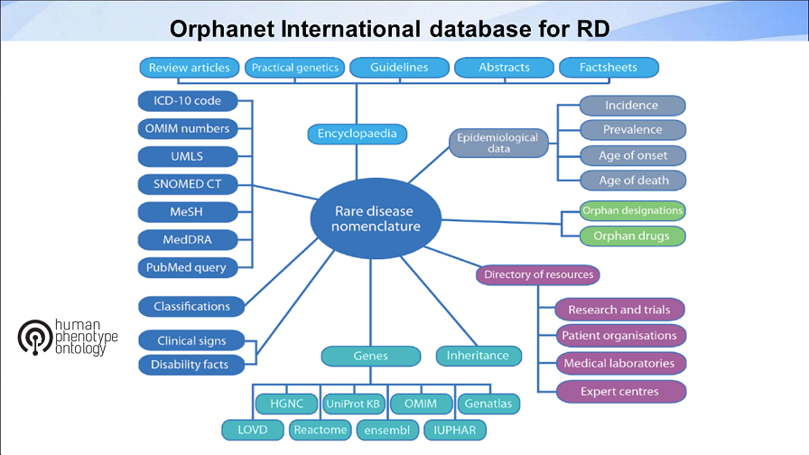
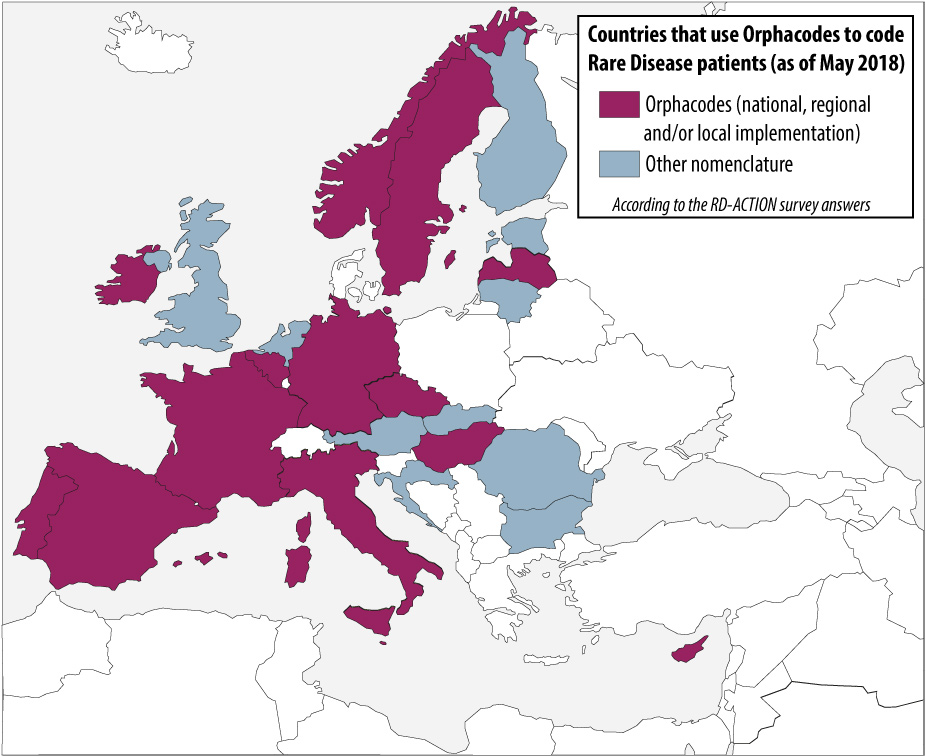
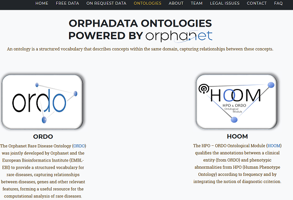
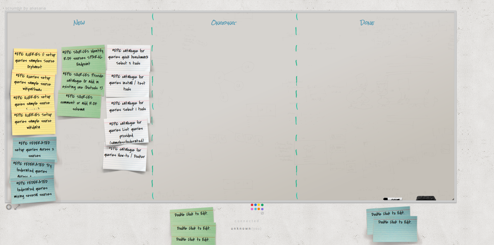

# Development of a catalog of federated SPARQL queries in the field of Rare Diseases

### Representative: Marc Hanauer

## Community
---

Orphanet INSERM US14 - ELixir FR - Excelerate WP8 RD use case

## Leads
---
Marc Hanauer, Andra Waagmeester

## Background information
---
Orphanet is a website dedicated to rare diseases, providing several kind of information such nomenclature, classifications, textual information, disorders/genes relations and also dedicated resources in the field (Experts centres, Diagnostic tests, clinical trials, orphandrugs, registries and biobanks, supports groups etc.) for more than 40 countries. 
The site has a huge audience, around 1 million unique visitors/month and 8 languages. 

The database content is linked to the Orphanet nomenclature

and we provide several dataset, also accessible on our platform Orphadata https://www.orphadata.org

Orphanet produce also the Orphanet Rare Diseases Ontology and clinical description of diseases using HPO ontology. Each disease concept has a unique, stable, identifier (Orphacode) which could be used to identify diseases in health information system. The orphacode has been integrated in several countries.

## Expected outcomes
---

Orphanet provides an ontology (ORDO) for rare diseases and also an ontological module (HOOM) to disseminate phenotypic information based on HPO. ORDO+HOOM are available with a blazegraph docker image and also a sparql endpoint. 

http://www.orphadata.org/cgi-bin/sparql.html

Blazegraph docker with ORDO and HOOM

http://www.orphadata.org/cgi-bin/docker/blazegraph_ordo_v2.6_hoom_v1.1.tar.gz

We will try to leverage the knowledge of RD by the uses of accessible sparql endpoint (EBI, wikidata, wikipathway, bio2rdf etc.) and provides a catalogue of relevant federated sparql queries

## Expected audience
---

programmes, ontologists : python, java, RDF/OWL, Sparql
**Expected hacking days**: 3 days

## Approaches to reach goals
1) Identify relevant resource in the RD field, available through SPARQL Endpoint
Starting point: EBI, Uniprot, Wikidata, Bioportal, Bio2RDF, neXtProt...

https://www.ebi.ac.uk/rdf/services/sparql

https://sparql.uniprot.org/sparql

https://sparql.nextprot.org/

https://github.com/bio2rdf/bio2rdf-scripts/wiki

Reactome
https://www.ebi.ac.uk/rdf/services/sparql

Disgenet
http://www.disgenet.org
http://rdf.disgenet.org/sparql/

wikipathways
https://www.wikipathways.org/index.php/Help:WikiPathways_Sparql_queries
http://sparql.wikipathways.org/

2) Setup user friendly web interface to :

a) manage/comment datasource

b) provide sample queries for each datasource

c) edit and manage queries

YAS GUI
http://about.yasgui.org/

https://github.com/comunica

http://jupyter.org/

https://pypi.org/project/sparqlkernel/

Wikibase
https://github.com/wmde/wikibase-docker

3) Modelise several SPARQL Federated Queries

Tasks can be done in parallel

## Tasks management
Kaban scrumblr
http://scrumblr.ca/bh2018-orphanet

## Related works and references
---

- https://www.orpha.net
- http://www.orphadata.org
- https://www.orpha.net/sparql

## GitHub or any other public repositories of your FOSS products (if any)
---

- https://github.com/Orphanet/Orphadata.org 

## Hackers
YOU !
---

